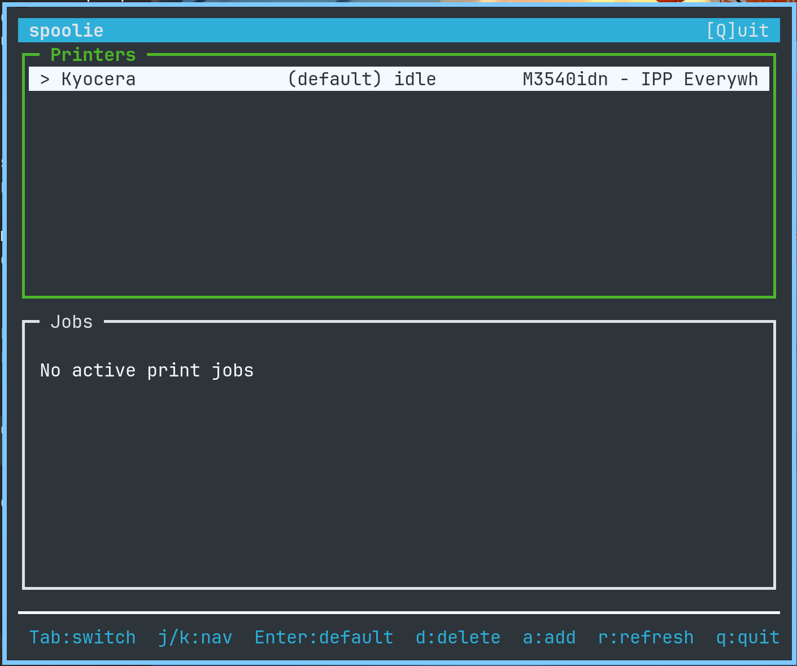

# spoolie

A friendly terminal UI for managing CUPS printers and print jobs.



## Features

- View and manage configured printers
- Set default printer
- Monitor and cancel print jobs
- Discover and add network printers (IPP/socket)
- Vim-style navigation

## Dependencies

- libcups
- ncurses (ncursesw for UTF-8 support)

### Arch Linux

```bash
sudo pacman -S cups ncurses
```

### Debian/Ubuntu

```bash
sudo apt install libcups2-dev libncursesw5-dev
```

### Fedora

```bash
sudo dnf install cups-devel ncurses-devel
```

## Install

Pre-built binaries for Linux, macOS, and FreeBSD are available on the [Releases](https://github.com/matthewp/spoolie/releases) page.

## Build

```bash
make
```

## Usage

```bash
./spoolie
```

### Keybindings

| Key | Action |
|-----|--------|
| `p` | Printers view |
| `j` (shift) | Jobs view |
| `a` | Add printer (discover) |
| `q` | Quit |

#### Printers view

| Key | Action |
|-----|--------|
| `j`/`k` or arrows | Navigate |
| `Enter` | Set as default |
| `d` | Delete printer |
| `r` | Refresh |

#### Jobs view

| Key | Action |
|-----|--------|
| `j`/`k` or arrows | Navigate |
| `c` | Cancel job |
| `r` | Refresh |

#### Discover view

| Key | Action |
|-----|--------|
| `j`/`k` or arrows | Navigate |
| `Enter` | Add selected printer |
| `Esc` | Cancel |

## License

BSD-3-Clause
